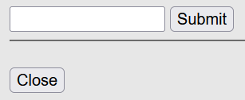
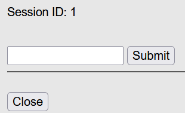
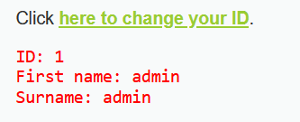
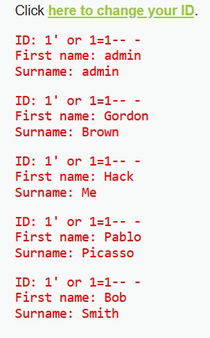
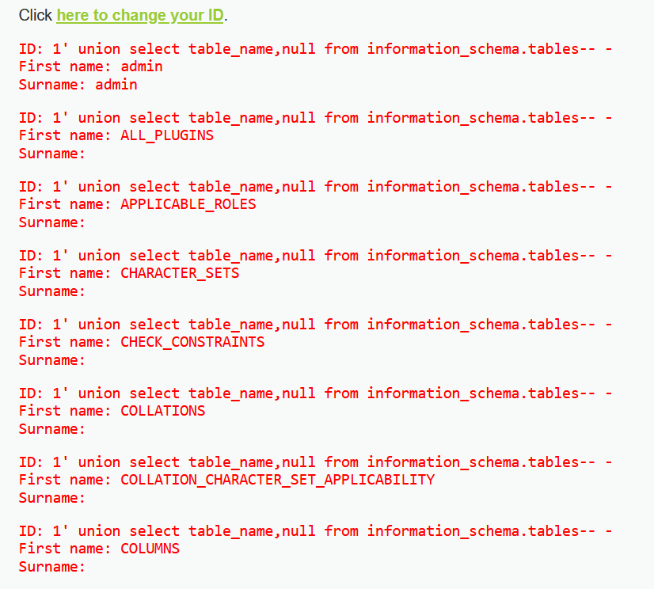
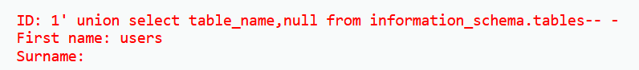
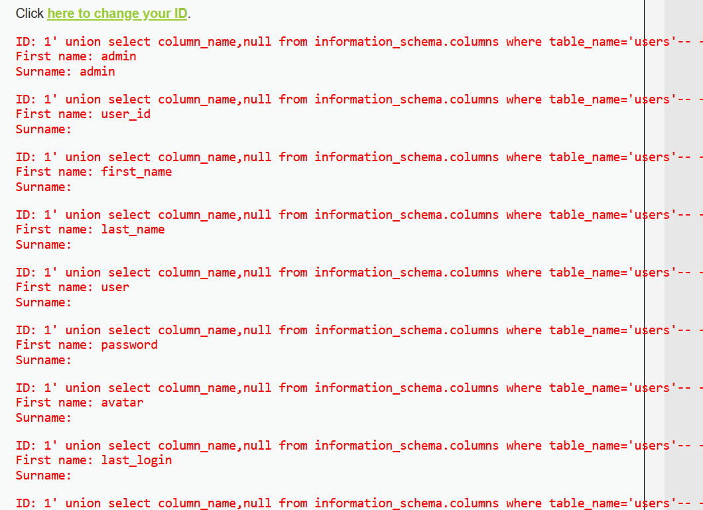
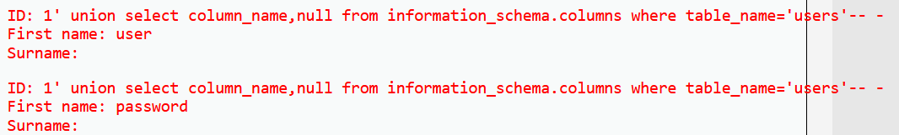
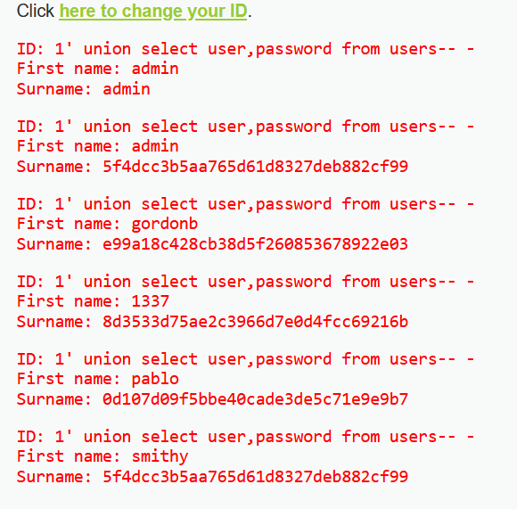

### TL;DR:
Making use of SQL injections to input malicious code inside session ID variable leading to databse and credential dumping

### Scope
**Target**: DVWA website(locally hosted)<br />
**Vulnerability**: CWE-89: Improper Neutralization of Special Elements used in an SQL Command ('SQL Injection')<br />
**Security Level**: High

In the High security level version of this lab a few changes were introduced, notably-
- Instead of input being given directly on the DVWA webpage, a link would direct me to a different page for input
- Unlikethe medium security level the input had changed from a drop-down list to a direct input by the user via typing
- The input was not directly concatenated with the SQL query, it was first saved to an "id" variable and the variable put in the query

### Pentest/Exploitation process:
**(1)** I first tested out the input field to get an idea of the functionality and was also able to find the number of outputter columns<br />
<br />
<br />
<br />
<br />

**(2)** After I had gotten an idea of the basic functionality I then went and confirmed that an SQL injection vuln did infact exist by setting the session id variable to  ```1  or 1=1-- -```<br />
<br />

**(3)** After confirming an injection vulnerability I then utilised the ```1 union select table_name,null from information_schema.tables-- -``` injection to dump tables and found an interesting user table once again.<br />
<br />
<br />

**(4)** With the users  table confirmed I then injected the request with  ```1 union select column_name,null from information_schema.columns where table_name=users``` and dumped all the columns names in "users"<br />
<br />
<br />

**(6)** From this I could confirm the prescence of the user and password tables so I then injected a packet with  ```1' union select user,password from users-- -``` to dump the rows<br />
<br />

**(7)** From here the process was the same as both the previous level, identifying the MD5 hash with hash-identifier, getting the plaintext password using John the Ripper and using obtained creds to login to the webpage<br />
<br />

<br />

<br />

<br />

### Impact:
Allowed to to dump and crack all user hashes leading to admin web page access

### Remediation:
**(1)** Use of parametrized queries instead of concatenation to prevent attacker from injection malicious SQL code into unput<br />

**(2)** Prevent databases such as "users" from being able to access tables such as "information_schema" to prevent cross-table columns dumping and table/column name extraction<br />

**(3)** Implementation of strong hashing algorithms(Argon, bcrypt, SHA-256 etc.) with salts instead of fast-crack hashes such as MD5 to prevent attackers from easily getting plaintxt password<br />

**(4)** Input validation(like was done in the previous level) to make sure attackers can't inject SQL queries into integer input fields as I could do in this lab
