### TL;DR
Use of a SQL injection UNION attack to dump username and credential database revealing hashed MD5 password for all users including the admin account which was cracked using John the Ripper to get full admin cred and access 

### Scope
**Target**: DVWA website(locally hosted)<br />
**Vulnerability**: CWE-89: Improper Neutralization of Special Elements used in an SQL Command ('SQL Injection')<br />
**Security Level**: Low

### Pentest/Exploitation process
**(1)** After testing out the User ID input I figured that it worked by entering an ID from (1-5) and would output a first-name and last-name<br />

**(2)** For a sanity check I used the ```1'order by 1/2/3..-- -``` injection in order to check the exact number of columns we are dealing with and found it to be 2 as can be seen from the output<br />
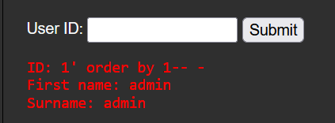<br />
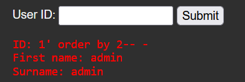<br />
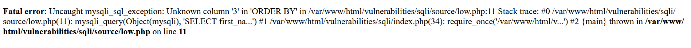<br />(Error on ```1' order by 3-- -``` tells us that we are dealing with only 2 columns, important for UNION attacks as number of columns from both tables need to be the same and it also revealed that the database is mysql)<br />

**(3)** I then used the ```1' union select table_name,null from information_schema.tables-- -``` to extract the table names of all tables in the database from the information_schema.tables table(standard in MySQL/MariaDB databases)<br />
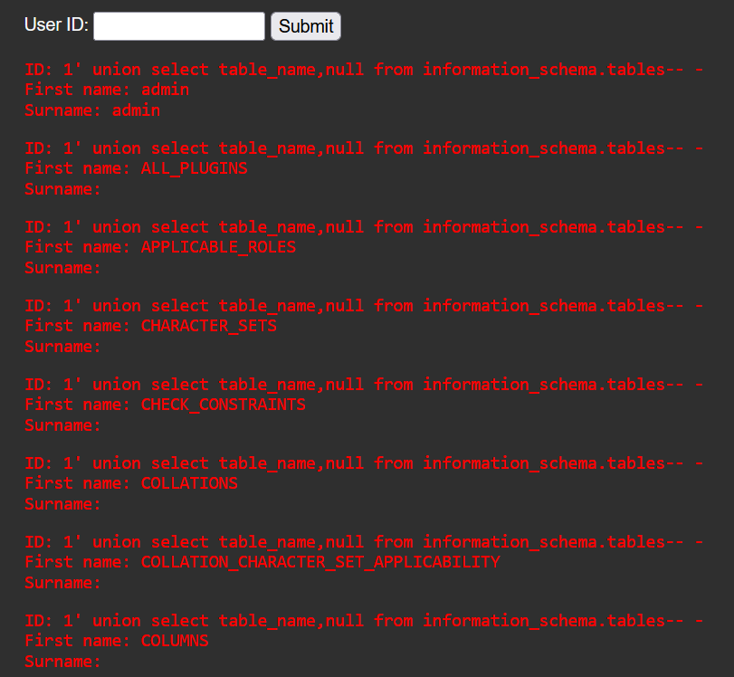<br />

**(4)** After looking through the dumped table names I found a "users" table which looked interesting<br />
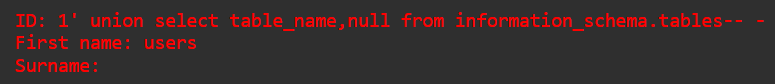<br />

**(5)** I then used the injection ```1' union select column_name,null from information_schema.columns where table_name='users'-- -``` to dump the names of all columns in the users table<br />
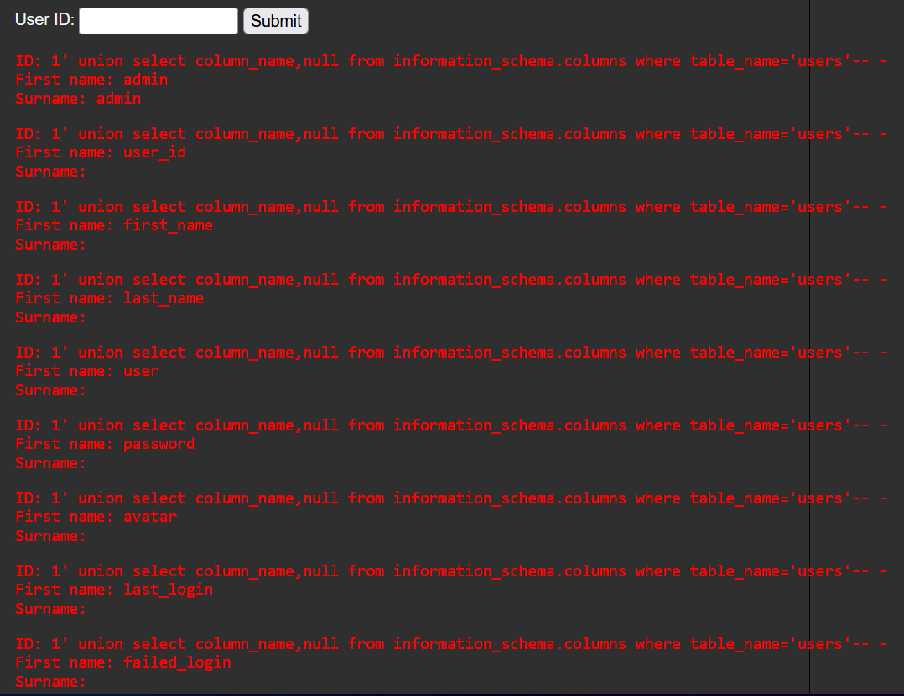<br />

**(6)** From this column dump there were two columns which really stood out to me, user and password<br />
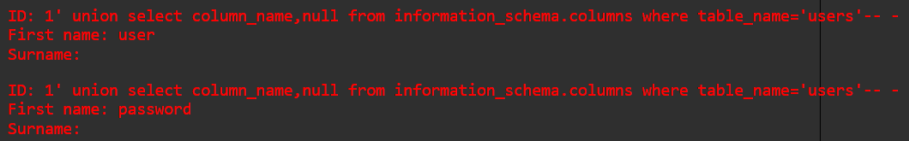<br />

**(7)** I used  ```1' union select user,password from users-- -``` to dump all the rows present in these two columns of the user table<br />
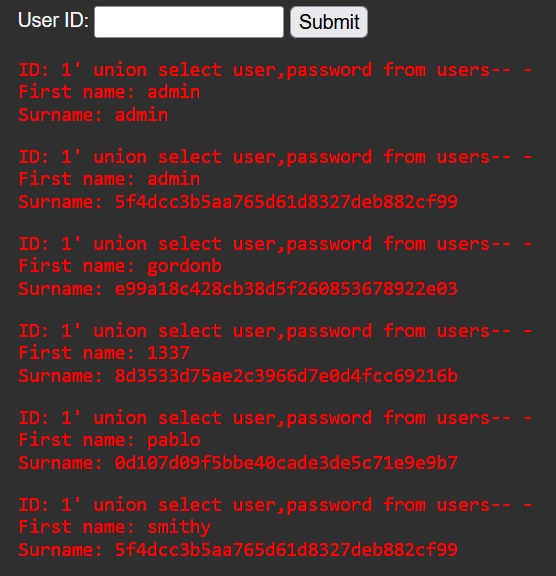<br />

**(8)** From the dump I was able to see usernames of all users along with their hashed password including the admin password<br />

**(9)** I utilised the hash-identifier tool in order to determine the hashing algorithm in use(MD5)<br />
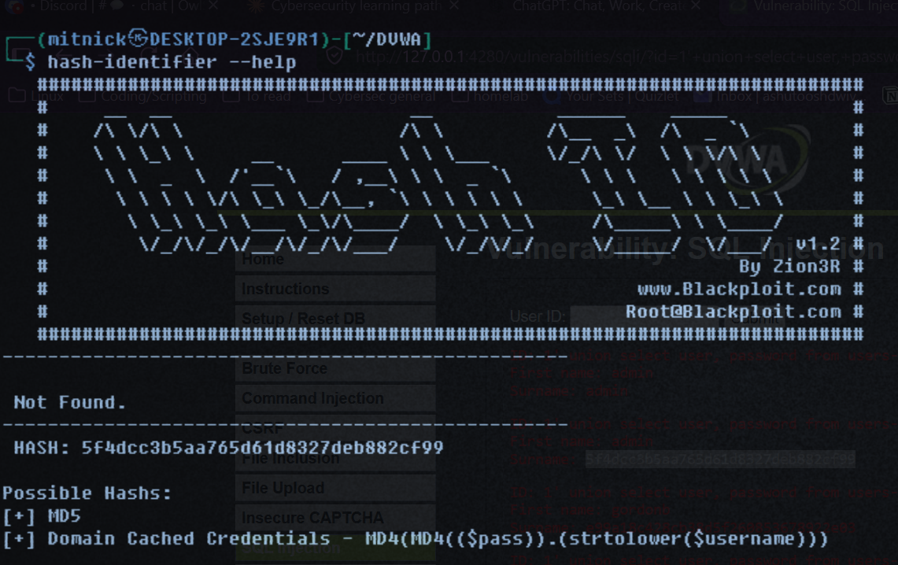<br />

**(10)** With the hash and hashing algorithm in hand I created a file called 'hash' with the admin password hash in it and used John the Ripper(CLI utility for hash-cracking) with the ```--format=raw-md5``` specifier to get the plaintext password<br />
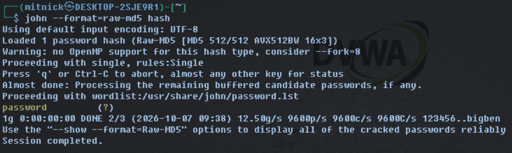<br />

**(11)** With the admin password in hand I went to the DVWA login page and with the credentials got admin access to the webpage<br />
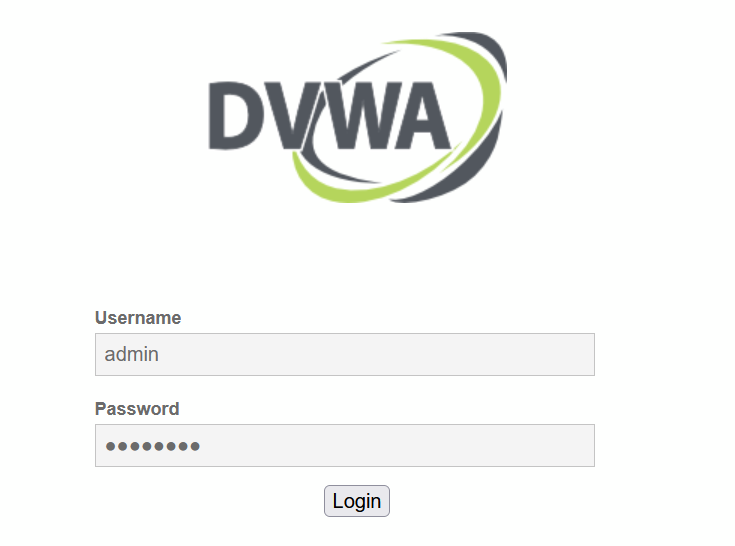<br />
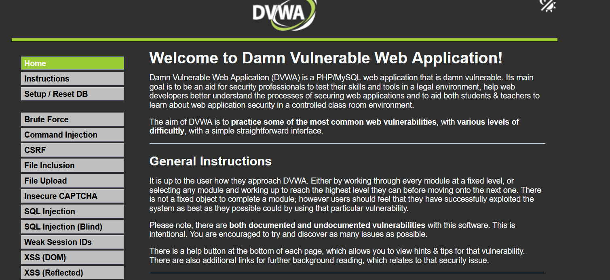<br />

### Impact
Allowed to to dump and crack all user hashes leading to admin web page access

### Remediation
**(1)** Use of parametrized queries instead of concatenation to prevent attacker from injection malicious SQL code into unput<br />
**(2)** Input validation in fields like User ID(i.e. it should only accept numeric data to prevent malformed/malicious inputs)<br />
**(3)** Prevent databases such as "users" from being able to access tables such as "information_schema" to prevent cross-table columns dumping and table/column name extraction<br />
**(4)** Implementation of strong hashing algorithms(Argon, bcrypt, SHA-256 etc.) with salts instead of fast-crack hashes such as MD5 to prevent attackers from easily getting plaintxt password<br />
**(5)** Use of more generic error messages, for example in this case the error message to ```1' order by 3-- -``` revealed that the database management engine I was interacting with was mysqli saving me later work of determining DBMS versions


