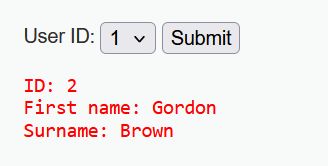
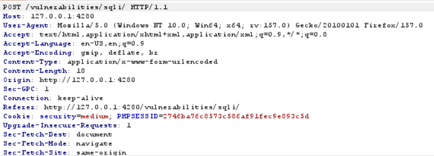
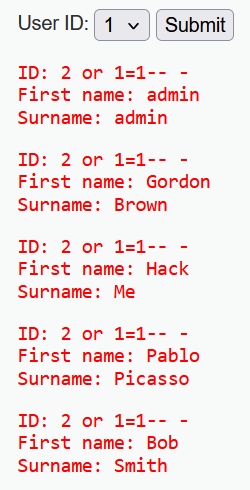
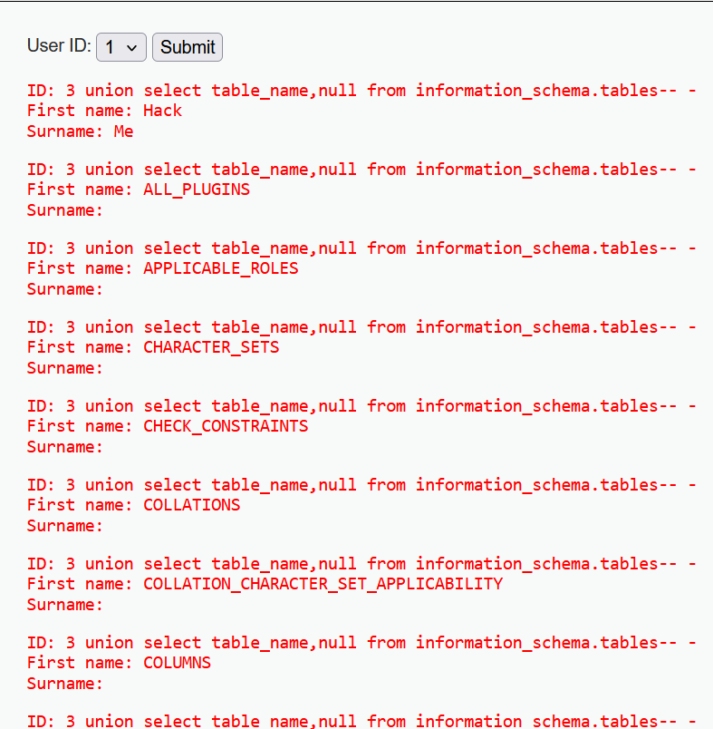
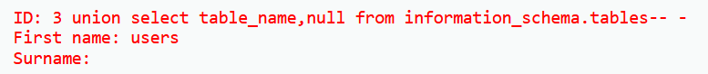
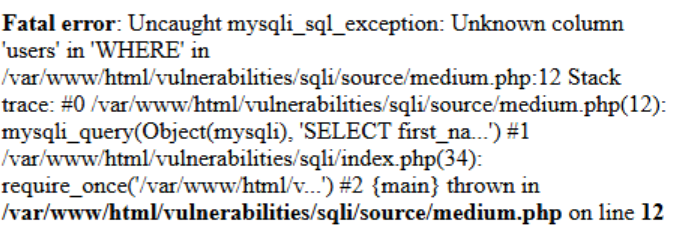
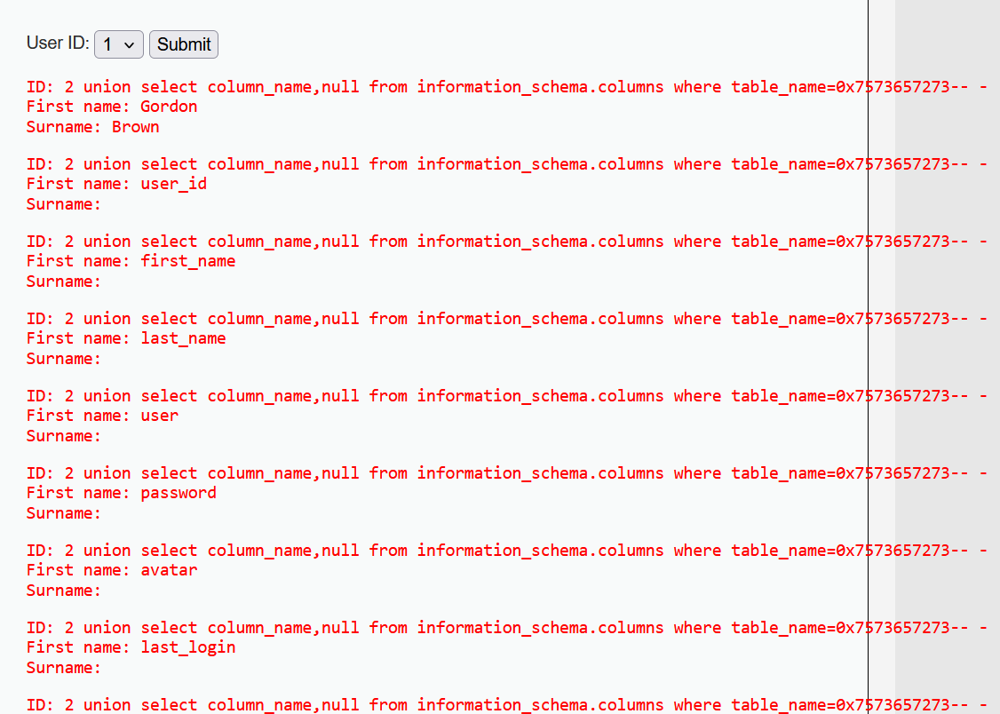
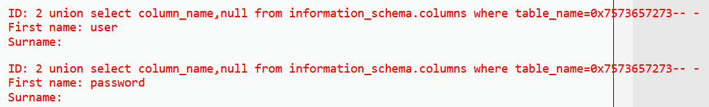
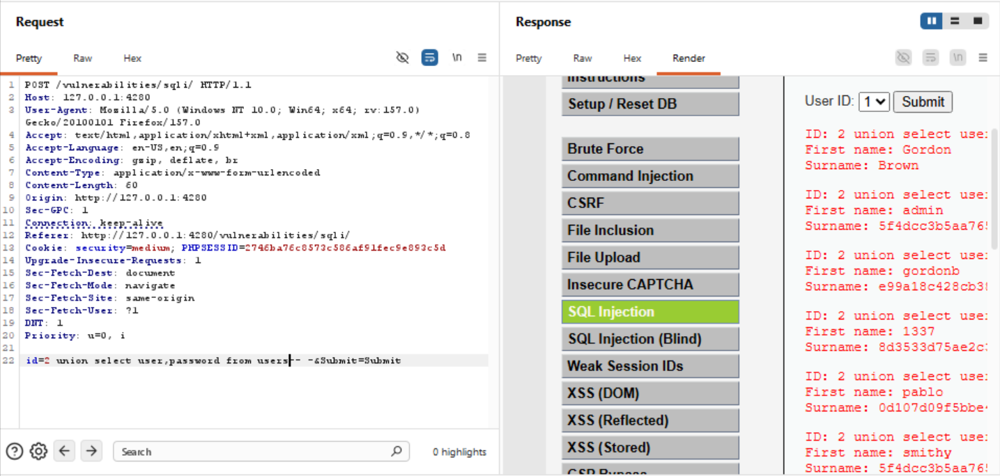
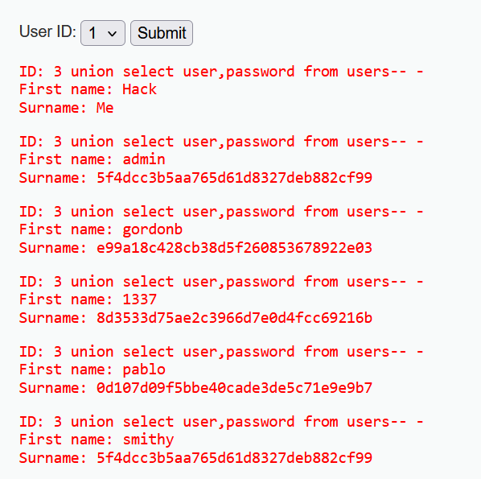

### TL;DR:
Intercepting webpage-database requests using burp suite to bypass mysqli_real_escape_string() and modifying the packet with a SQL injection to dump databases and get user credentials 

### Scope
**Target**: DVWA website(locally hosted)<br />
**Vulnerability**: CWE-89: Improper Neutralization of Special Elements used in an SQL Command ('SQL Injection')<br />
**Security Level**: Medium

In the Medium security level version of this lab a few changes were introduced, notably-
- The backend sql query now uses mysqli_real_escape_string() to prevent the use of special characters such as ', ", /, NULL etc. since they now get treated as normal characters preventing attacker from escaping the input string and execuitng malicious code
- This would be a problem if we were dealing with string data type input which would require the ' to escape but here we have integer input so we can just include our code directly with no issues, a good solution for the wrong situation
- Along with this the input field now makes use of a drop-down menu giving options of number 1-5 and also switched the GET method for POST preventing us from injecting code directly in the input field or the site url for command execution
- Due to this for this lab the use of burp suite is required in order to capture and modify the request with malicious code<br />

### Pentest/Exploitation process:
**(1)** I first tested out the input field with various ID's to get an idea of the output and from this I was also able to find the number of columns we were dealing with(2)<br />


**(2)** After I had gotten an idea of the basic functionality I then went and confirmed that an SQL injection vuln did infact exist by capturing the request and modifying it to dump all the table by adding ```2  or 1=1``` in the ID field of the request<br />
<br />
<br />

**(3)** After confirming an injection vulnerability I then utilised the ```3 union select table_name,null from information_schema.tables-- -``` injection to dump tables and found an interesting user table once again.<br />
<br />
<br />

**(4)** With the users  table confirmed I then injected the request with  ```1 union select column_name,null from information_schema.columns where table_name=users but here I encountered the following error<br />
<br />
Upon further research I found that this issue was caused since the "where" clause in the sql query expects a string literal to use as an identifier for the table name but due to the query not being wrapped in quotes and my inability to do so because of mysqli_real_escape_string() it is parsed as raw text and hence the query defaulting to using it as a column_identifier instead(which it is not) hence the error<br />

**(5)** The fix to this was to instead use the hex value of the "users" string since being hex it does not need to be wrapped in quotes and and can be used as a comparison value for the WHERE clause since it would resolve to the same string after being parsed. />
<br />
<br />

**(6)** From this I could confirm the prescence of the user and password tables so I then injected a packet with  ```2 union select user,password from users-- -``` to dump the rows(here I did not need to use hex since the "from" clause expects an identifier not a string literal)<br />
<br />
<br />

**(7)** From here the process was the same as the last level, identifying the MD5 hash with hash-identifier, getting the plaintext password using John the Ripper and using obtained creds to login to the webpage<br />
<br />

<br />

<br />

<br />

### Impact:
Allowed to to dump and crack all user hashes leading to admin web page access

### Remediation:
**(1)** Use of parametrized queries instead of concatenation to prevent attacker from injection malicious SQL code into unput<br />

**(2)** Checking specific contextx and situations for a fix, for example in this lab the mysqli_real_escape_string() acted as a sanitization function which does prevent string escapes but exactly that, for strings and here the input was integer so the fix wasn't compatible with the problem it was used to solve which has to be considered<br />

**(3)** Prevent databases such as "users" from being able to access tables such as "information_schema" to prevent cross-table columns dumping and table/column name extraction<br />

**(4)** Implementation of strong hashing algorithms(Argon, bcrypt, SHA-256 etc.) with salts instead of fast-crack hashes such as MD5 to prevent attackers from easily getting plaintxt password<br />

**(5)** Use of more generic error messages, for example in this case the error message to ```1' order by 3-- -``` revealed that the database management engine I was interacting with was mysqli saving me later work of determining DBMS versions


