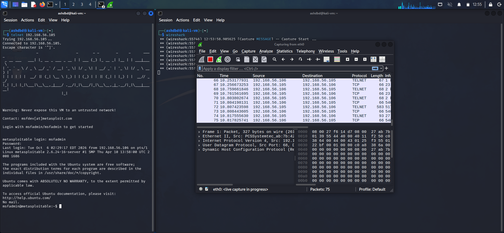
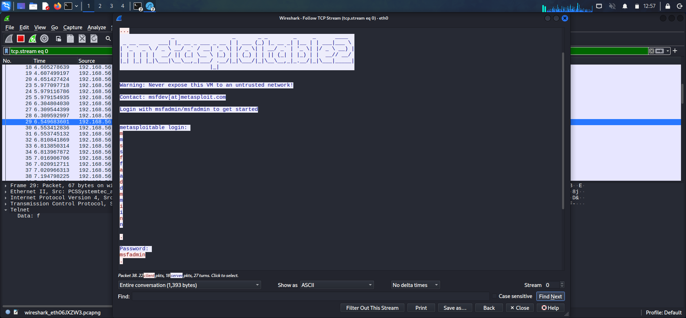
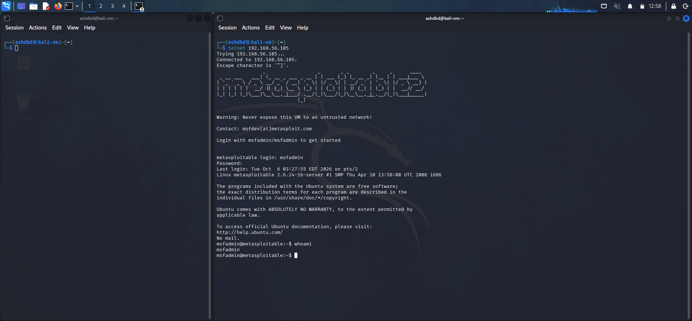

**Target**: Metasploitable 2 VM<br />
**Service**: Telnet packet capture<br />
**Port**: 23<br />
**Vulnerability**: CWE-319: Cleartext Transmission of Sensitive Information<br />
**Severity**: High(leaning towards Critical)<br />

#### (1) Reconnaissance
Once again as all pentests do this one also began with reconnaissance<br />
I utilised nmap to scan the top 100 ports on the metasploitable machine to identify open and running services<br />
```nmap -sV -A --top-ports 100 192.168.56.105```<br />

### (2) Exploitation
- I first simulated a telnet login on a different terminal and used wireshark(packet sniffer) scanning on eth0 to capture the traffic

- After I had captured the packets sent across the interface during login I stopped capture and opened up TCP stream in the Analyze option on wireshark to get a visual representation(which includs creds) that were captured

- Once I had identified the creds through the help of TCP stream I used them to Telnet into the machine


Impact: I was able to passively capture telnet traffic which allowed me to get my hands on user credentials which I could use to login to the machine without tripping off any alarms 

### (3) Remediation
- Instead of telnet utilise an encrypted service such as SSH for remote connections which prevents attackers from seeing plaintext credentials and data even if they have captured the packets
 
