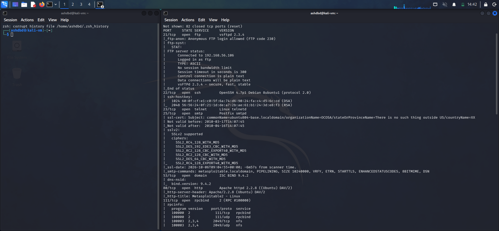
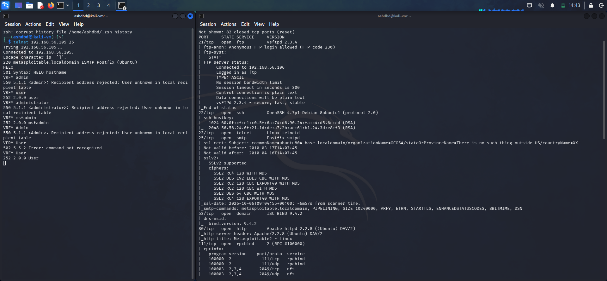
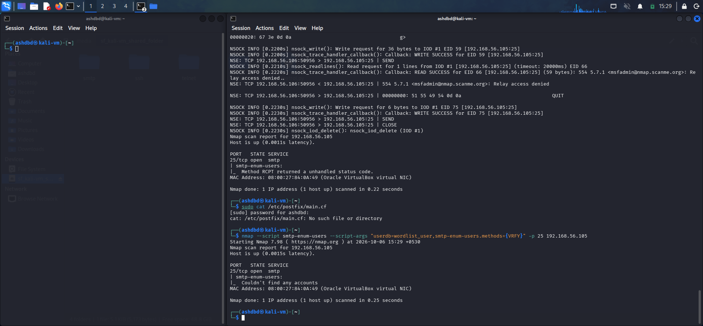
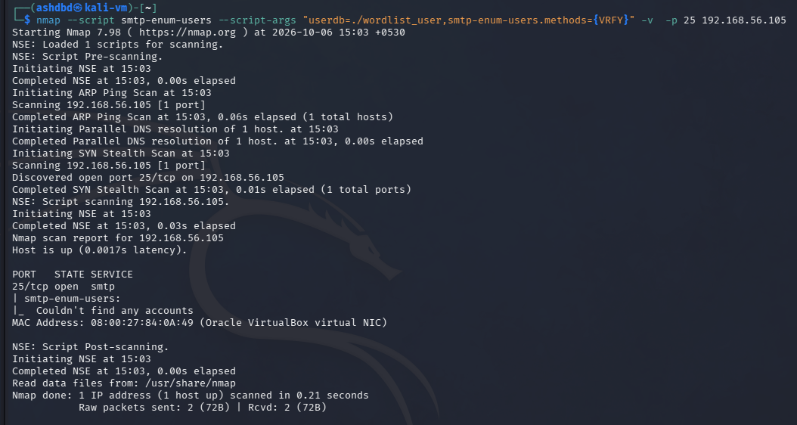
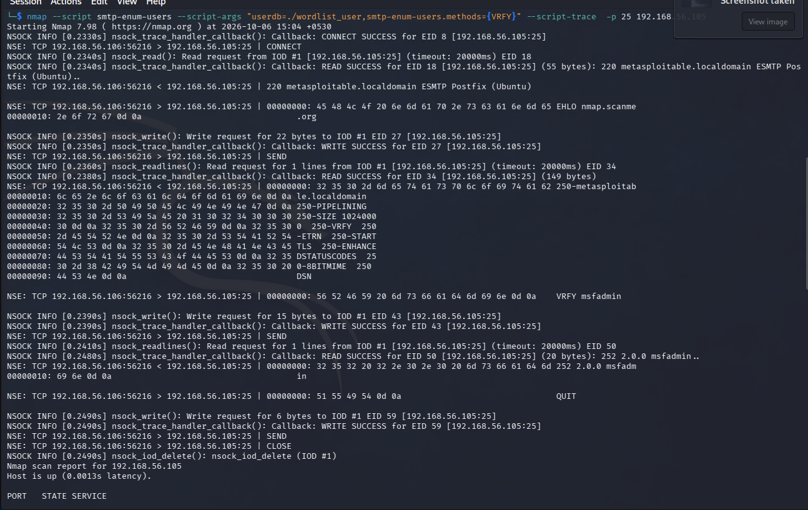
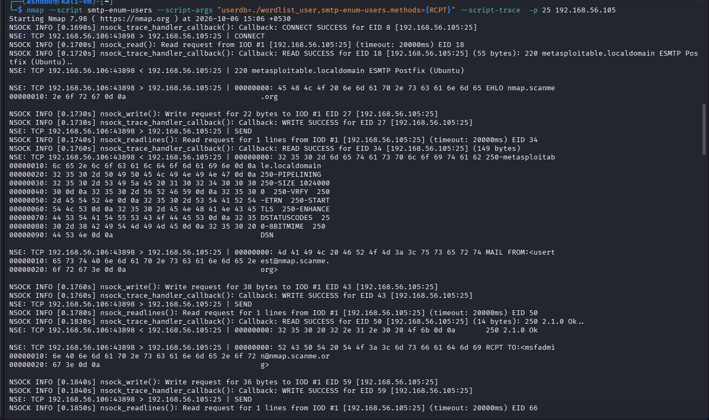
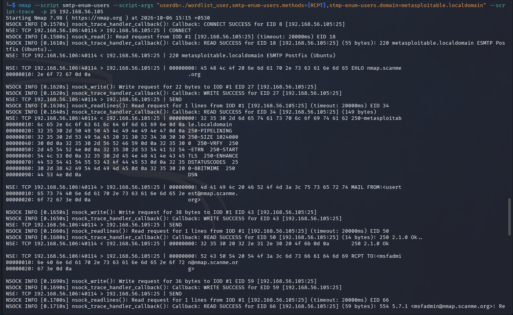
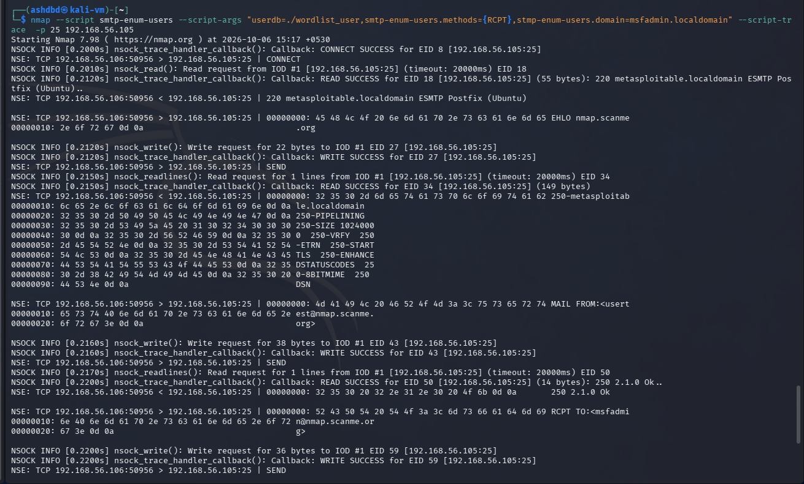
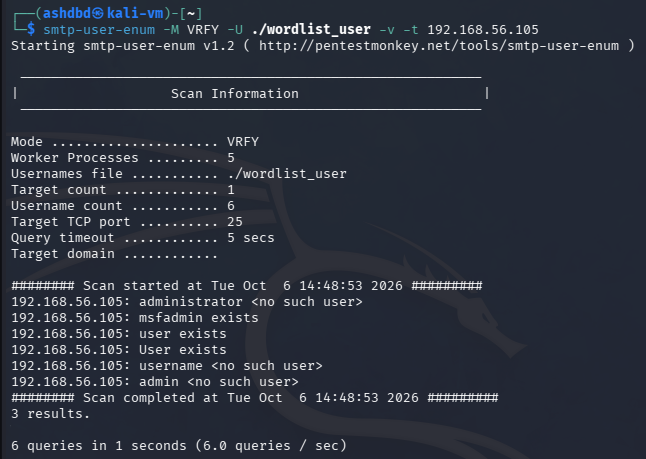

**Target**: Metasploitable 2 VM<br />
**Service**: SMTP(simple mail transfer protocol)<br />
**Port**: 25<br />
**Vulnerability**: CWE-204: Observable Response Discrepancy<br />
**Severity**: Low to Medium(no immediate effect, reconnaissance which can be used to extract info to aid other attacks)<br />

SMTP is a protocol that acts as a relay to route mail from senders to recipient servers, while it cannot be "exploited" in itself in the traditional sense we can enumerate it to extract some information(User account identifiers/usernames) that we can use in further attacks.<br />

### Enumeration:
(1) We first run an nmap scan to identify the exact port on which SMTP is running(almost always port 25) along with other details regarding ciphers and commands we can execute<br />

(2) Once we have identified the port we can now enumerate in a couple of ways, namely using (1) Telnet (2) Nmap in script mode and (3) smtp_user_enum(enumeration in tool)<br />
(A) **Enumeration using Telnet**:
- First we use telnet to initiate a connection to the target machine on port 25
```telnet 192.168.56.105 25```
- This puts us in a session where we can query the SMTP server using the commands we discovered in the intial Nmap scan
- We can query the server via the  ```VRFY``` command (usage: VRFY <username>) which returns a 550 if the user does not exist and 250 if it does

- From this we found that msfadmin, user and User are all accounts on the machine<br />
(B) **Enumeration using Nmap**:
- To enumerate using nmap I initiated a port scan on port 25 and utilise the smtp-enum-users scripts with the VRFY method

- But when I ran this it was showing that no local accounts were found which should not have been the case, to debug this I ran the scan again but with the "-v"(verbose) flag to give me more info

- When even the verbose output did not give me a solution I included the "--script-trace" option which would allows me to track the actual communication with the SMTP server

- From this I found that when using the "VRFY" method the SMTP server was returning 252 status codes instead of the cleaner 250 which is a mechanism delberately included to prevent enumeration using the "VRFY" method, this status code mismatch could cause error in the scripts usage due to parsing and how it handles status codes
- So I then decided to utilise the "RCPT" methods instead which give 250 status codes as it's original purpose was a basic functionality so it has no in-built methods to ward off enumeration unlike "VRFY"

- Even with RCPT the script wasn't working so I looked throguh the communications and found "Relay access denied" which, upon further research, occurs when the domain(s) specified in the scan argument are out of scope of the Postfix server
- So I then added a domain argument initially using the domain provided in the banner that the SMTP server gave me upon connection(metasploitable.localdomain)

- Even with the banner specified domain included the scan was unsucessful, so I then tried another possible domain(msfadmin.localdomain)

- When even this domain didn't work I took a last resort of searching through the Postfix configuration files but I wasn't able to access them due to various issues and ultimately had to leave it at this<br />
(C) **Enumeration using smtp-user-enum**:
- The tool makes it really simple to brute-force usernames on the SMTP server, I specified the method(VRFY), the wordlist and the target IP and started the tool

- From this I was easily able to find the present users

Impact: The enumeration itself does not have much of a direct impact, but the usernames that we get from the enumeration can then be used in other attacks for example in brute-forcing(such as SSH brute-forcing which I did in the previous report) to reduce cracking times since we have a username or in spearfishing campaigns to make the emails seem more legit via the use of internal domains
Note: When we use the VRFY method to confirm domain prescence it should return a status code 250 which confirms the prescence but in this case it returned 252 which does not confirm the prescence of the domain making the enumeration more vague, this is a security mechanism that is implemented specifically to prevent enumeration using the VRFY method

### Remediation:
- Disable VRFY and EXPN methods on SMTP servers to prevent attackers from leveraging them for enumeration purposes as we did here
- Implementation of rate-limiting on port 25(SMTP) to prevent brute-forcing of usernames as we did with smtp-user-enum
- Avoid the use of predictable usernames that are easy to guess/would be included in wordlists  
  
