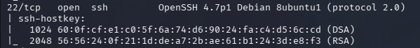
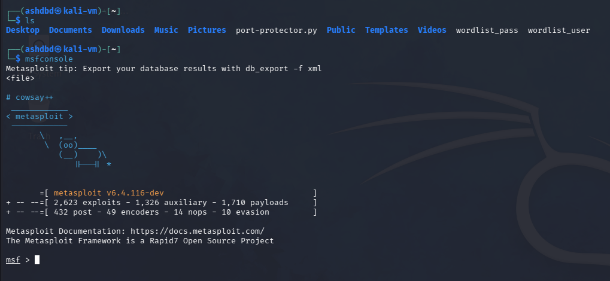
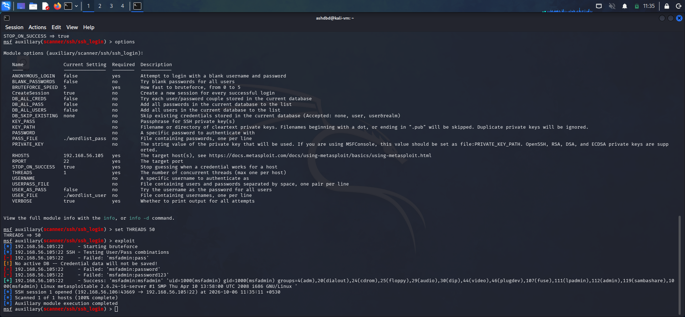
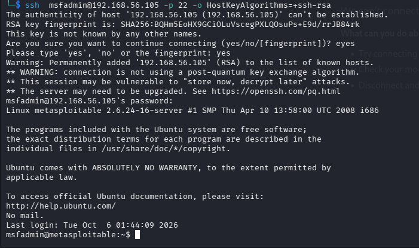

**Target**:Metasploitable 2 VM<br />
**Service**: SSH(secure shell)<br />
**Port**: 22<br />
**Vulnerability**: Brute-Forcing attack<br />
**Severity**: High<br />

### (1) Reconnaissance
The first test in the pentest was to map out the attack surface and determine the exact port and ssh service version<br />
For this purpose I utilised nmap, running the following command -<br />
```nmap -sV -A --top-ports 1000 192.168.56.105```<br />
From this scan I got the following results-<br />



### (2) Exploitation
Now that I had identified the port and service version it was time to move onto the exploitation stage<br />
I utilised the "scanner/ssh/ssh_login" payload on metasploit in order to execute the bruteforce
- Opening up msfconsole

- Using and configuring required options for the payload and exploitation

- SSH login with credentials found using brute-force


Impact: I was able to get an ssh shell in the system by utilising the credentials I had found from the brute-force attack

Note: Brute-forcing as an attack is highly dependent on the password regulations followed in a system and in real-world use cases can differ a lot in ease of use and feasability. For this pentest I had made custom wordlists for usernames and password which included the credentials for the metasploitable 2 VM(as I previously knew), in real life much bigger wordlists such as rockyou.txt would be utilised and hence cracking time would exponentially increase

### (3)Remediation
- Utilise a strong password that combines aplphanumeric and special characters, is of a suitable length and is random, along with a hard to guess/unusual username to ward-off brute-forcing attacks
- Ditching password based-authentication entirely in favour of public-privat key authentication
- Implementing fail2ban or similar systems to detect unusual activity on ports and implementing rate-limiting
