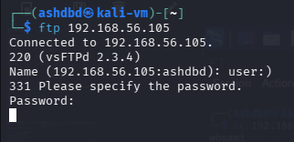
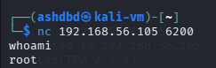
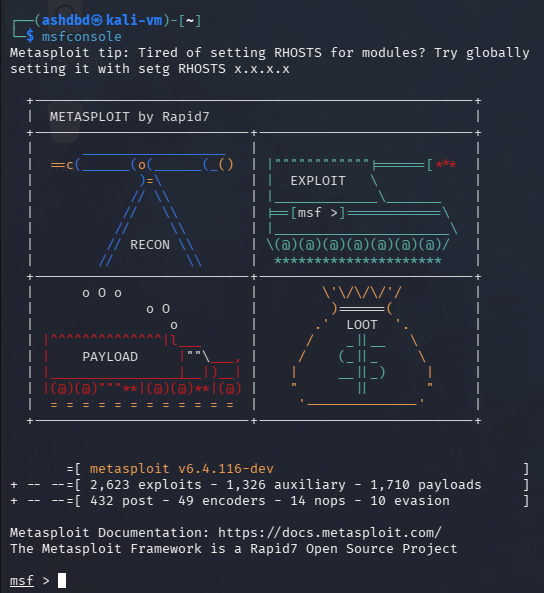
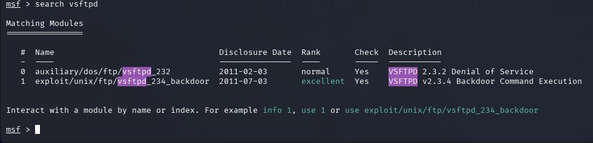
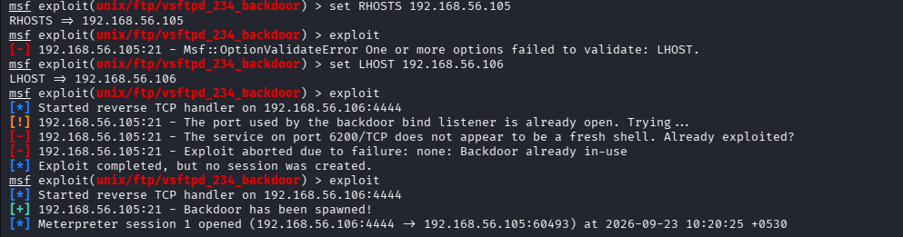
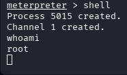

Target: Metasploitable 2 VM<br />
Service: vsftpd 2.3.4<br />
Port: 21<br />
Vulnerability: CVE-2011-2523<br />
Severity: Critical<br />

#### (1) Reconnaissance
The pentest started off by running nmap against the target VM with the script, OS detection, version detection and aggressive flags enabled scanning the top 1000 ports <br />
```
nmap -sVC -O -A --top-ports 1000 192.168.56.105
```
The scan led me to uncovering an open FTP port(port 21)<br />


From the scan I could also see that the FTP service was vulnerable to anonymous logins but even more critically it was running vsftpd 2.3.4, a severely unsafe version of FTP in which a backdoor was implanted by the attacker into the official release in 2011.<br />

The backdoor allows anyone to gain a root shell into the system by typing ':)' into the username filed when logging in which opens a remote listener on port 6200 which can be accessed to gain a root shell into the target system instantly.<br />

#### (2) Exploitation:
- The first step was to login into FTP using the malicious backdoor implanted into the source code<br />
```
ftp 192.168.56.105
```
- Then at the login prompt in user I typed "user:)" and for password I types "pass" since for this vulnerability any string of characters is acceptable as a password<br />

- After this I connected to the listener on port 6200 of the target machine using netcat which dropped me into a root shell giving me full unrestricted access to the system<br />


Now I did the same exploit once again but this time using metasploit payloads for automation and ease of use<br >?

The first step was to launch msfconsole <br />


After this I searched for "vsftpd" which showed me 2 available payloads for versions 2.3.2 and 2.3.4<br />


I selected the vsftpd_234_backdoor exploit and configured required details(RHOSTS and LHOST)<br />




I then launched the exploit which automatically opened a meterpeter session from where I launched a shell, giving me root access into the system<br />



Impact: The vulnerability gave me root level access to the entire system within minutes without setting off any alarms as the vuln was baked into the source code 
#### (3)Remediation:
- Immediately upgrade FTP to a cleaner, more secure and non-backdoored version
- Apply SIEM/IDS rules to listen for sustained connection on unusual/random ports which could be listeners/shells 
